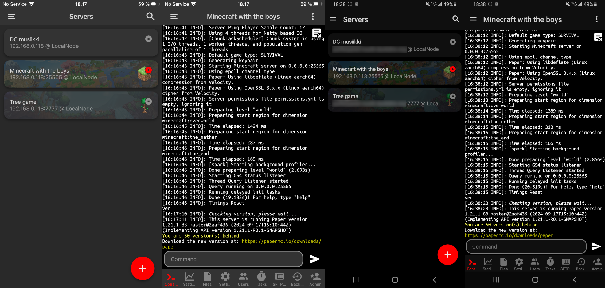

# Pallokala

Pallokala is a mobile client for [PufferPanel](https://www.pufferpanel.com) available on Android and iOS made with React Native.

> [!NOTE]  
> Pallokala is still in development. Not all features are implemented yet and there may be bugs.

## Notable features

- Multi-account support
  - Email and OAuth login
  - Ability to save 2FA secret for easier login
- AMOLED dark mode
- Decompress .log.gz files in memory to view old logs easily
- Customizable console font size
- Server list widget
- SFTP file manager
  - View file permissions
  - Rename files
  - Move files
- App shortcuts/Quick actions

## Coming soon

- Template management
- Server info widget

## Missing features

- Passkey support
- Template management
- Themes (Won't be implemented)

## iOS

Pallokala is not available on the App Store due to insane Apple developer license pricing.
You can get the .ipa file from the releases page and sideload it using SideStore or similar apps.